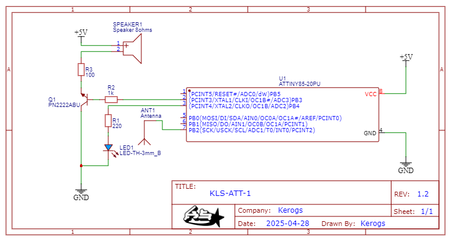
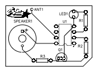
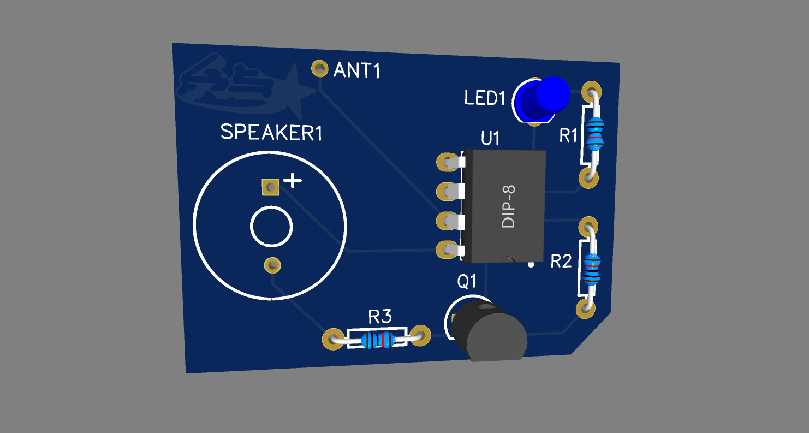

# KLS-ATT85-1

## Description

**KLS-ATT-1** is an electromagnetic field (EMF) detector project based on an **ATTINY85** microcontroller (or compatible alternatives) or an **Arduino** board.  
A simple copper wire antenna, shaped into a loop at its tip, captures ambient electromagnetic variations.  
This allows the system to detect phenomena such as human presence, local electromagnetic disturbances, or even atmospheric activity like thunderstorms.

When a significant variation is detected, the system activates a LED and/or a buzzer to signal the event.

---

## Features

- Detects electromagnetic field variations using a simple antenna
- Activates a LED and buzzer upon detection
- Two code versions available:
  - **Arduino** (Uno, Mega, etc.)
  - **ATTINY85** and compatible chips (ATTINY13, 25, 45, 85)
- Custom PCB design for through-hole components
- Provided schematics and editable files for adaptation

---

## Schematics and PCB

Inside the [`schematics/`](schematics/) folder, you will find:
- Wiring schematic diagrams (images and editable files)
- PCB design files
- All necessary resources to adapt or modify the project

**Important notes:**
- The PCB is designed for microcontrollers with a **DIP 8-pin** package.
- If your MCU has more than 8 pins, the PCB **will not be compatible** without modifications.
- Always double-check pin assignments if using a different microcontroller.

---

## Components List

| Quantity | Component                          |
|:--------:|:-----------------------------------|
| 1        | Arduino Uno/Mega **or** ATTINY85 (or ATTINY13/25/45/85) |
| 1        | LED                                |
| 1        | 220 Ω resistor (for the LED)        |
| 1        | 1 kΩ resistor (for transistor base) |
| 1        | 100 Ω resistor (for buzzer)         |
| 1        | NPN transistor (PN2222A)            |
| 1        | 8-ohm speaker (standard Arduino type) |
| 1        | Antenna (copper wire loop)          |

---

## Important Notes

- **Removing the buzzer**:  
  You can remove the speaker, the 1kΩ and 100Ω resistors, and the PN2222A transistor if you only want to use the LED for detection feedback.

- **Removing the LED**:  
  You can remove the LED and the 220Ω resistor if you only want to use the buzzer.

- **Speaker compatibility**:  
  The PCB and schematic were designed specifically for a small **8-ohm** speaker, the type commonly used in Arduino projects.  
  Using a buzzer or a different speaker type may require adjusting component values.

- **Power supply considerations**:  
  ⚠️ It is highly recommended **not** to power the circuit directly from a mains adapter (wall power supply).  
  The presence of strong electrical noise can affect the sensitivity and reliability of the antenna readings.  
  Instead, use batteries or an isolated, low-noise power source to ensure correct operation.

- **PCB reliability**:  
  The PCB design was not physically tested. Although the circuit is theoretically sound, you use it **at your own risk**.  
  Please carefully verify the schematic and PCB layout before fabrication.

---

## Illustrations

**Schematic Diagram:**

**PCB Layout:**

**PCB 3D:**

---

## Acknowledgments

I was (greatly) inspired by the video (code and installation) from the French YouTuber **Thonain**:  
👉 [YouTube Video (in French)](https://youtu.be/DCMp2S7ite4?si=R_xh_qELCqetFBuS)